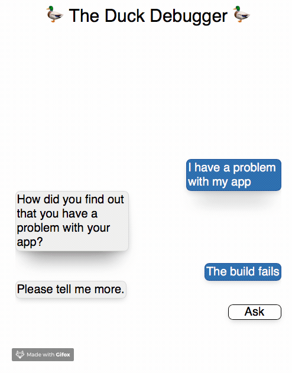

# The Duck Debugger

[Try it out!](https://torvaney.github.io/projects/duck-debugger)

## What is it?

The Duck Debugger is a simple chatbot to help you work through your programming problems.

## What's with the duck?

[Duck debugging](https://rubberduckdebugging.com) is a method
of solving problems by talking them through. The listener could be a colleague,
a friend or even... a rubber duck? A computer program?

## This seems familiar...

The Duck Debugger is based on the seminal computer program
[ELIZA](https://en.wikipedia.org/wiki/ELIZA), with minor details altered to
suit duck debugging.

## I have an idea for improvement

Submit an issue or a PR, contributions are more than welcome!
